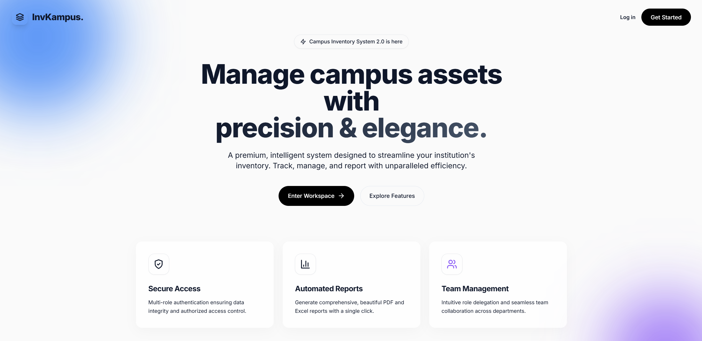
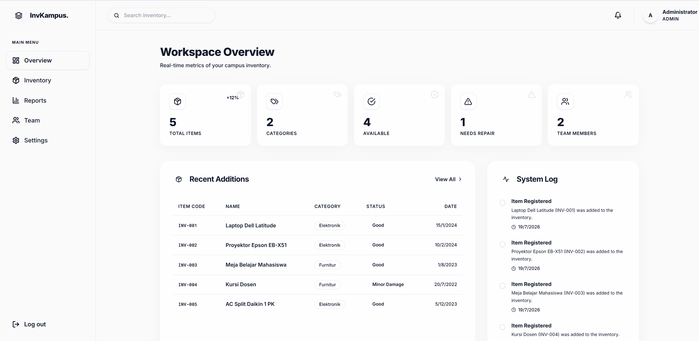

# 🚀 InvKampus - Sistem Inventaris Barang di Kampus


InvKampus adalah sistem manajemen inventaris barang kampus berbasis web yang modern, cepat, dan efisien. Dirancang untuk memudahkan admin dan petugas dalam mencatat, mengelola, dan melaporkan kondisi barang inventaris di lingkungan kampus. Dibangun dengan antarmuka yang elegan menggunakan Next.js dan Tailwind CSS, aplikasi ini memastikan pengalaman pengguna yang responsif. Di sisi backend, aplikasi ditenagai oleh **Next.js API Routes**, **Prisma ORM**, dan **MySQL** untuk manajemen data yang aman dan handal.

---

## 📸 Cuplikan Layar (Screenshots)
*(Di bawah ini adalah gambaran halaman utama aplikasi)*

| Landing Page | Dashboard Inventaris |
| :---: | :---: |
|  |  |

## ✨ Fitur Utama

### 🧑‍💻 Fitur Petugas (User)
* **Manajemen Barang:** Lihat daftar barang inventaris beserta detail kondisi (Baik, Rusak Ringan, Rusak Berat) dan kategorinya.
* **Pencatatan Baru:** Tambahkan data barang inventaris baru lengkap dengan kode barang, lokasi, dan kuantitas.
* **Dashboard Interaktif:** Pantau statistik total barang, kategori, dan kondisi barang secara real-time.
* **Ekspor Laporan:** Generate laporan daftar barang dalam format **PDF** atau **Excel** dengan satu klik.

### 🛡️ Fitur Administrator
* **Hak Akses Penuh:** Memiliki semua fitur yang dimiliki oleh Petugas.
* **Manajemen Pengguna:** Menambahkan, mengedit, atau menghapus akun Petugas yang bisa mengakses sistem.
* **Hapus Barang:** Admin memiliki hak eksklusif untuk menghapus data barang dari sistem jika diperlukan.

---

## 🛠️ Teknologi yang Digunakan

* **Backend:** Next.js (App Router API), Prisma ORM
* **Database:** MySQL
* **Frontend:** Next.js 13.5, React 18.2, Tailwind CSS v3
* **Autentikasi:** NextAuth.js v4 (dengan bcrypt password hashing)
* **Visual & Laporan:** jsPDF (PDF Export), SheetJS (Excel Export), Lucide React (Ikon)
* **Desain UI/UX:** Komponen antarmuka yang modern dengan efek blur/glass dan animasi yang responsif.

---

## 💻 Cara Instalasi & Menjalankan (Local Development)

Aplikasi InvKampus sangat mudah dijalankan menggunakan **XAMPP/Laragon** atau server lokal MySQL lainnya.

### 1. Persiapan Database
1. Pastikan **XAMPP/Laragon** sudah terinstal dan berjalan (Start Apache & MySQL).
2. Buka fitur database (phpMyAdmin / HeidiSQL) di `http://localhost/phpmyadmin`.
3. Buat database baru dengan nama `inventaris_kampus`.
4. Import file `inventaris_kampus.sql` ke dalam database tersebut (File ini sudah berisi skema tabel dan data awal/seed).

### 2. Setup Environment
Buka terminal di dalam folder proyek dan jalankan perintah berikut:

1. **Install Dependensi:**
   ```bash
   npm install
   ```
2. **Konfigurasi .env:**
   Pastikan file `.env` memiliki konfigurasi untuk kebutuhan masing'
   ```env
   ```

### 3. Menjalankan Aplikasi
Setelah dependensi terinstal, jalankan server pengembangan Next.js dengan perintah:
```bash
npm run dev
```
Aplikasi akan aktif. Buka browser Anda dan kunjungi: 
```text
http://localhost:3000
```

> **Catatan Akun Akses Default:** 
> Gunakan kredensial default ini untuk masuk ke dalam sistem:
> - **Admin:** Username: `admin` | Password: `admin123`
> - **Petugas:** Username: `petugas1` | Password: `petugas123`
# Sistem Inventaris Barang di Kampus
